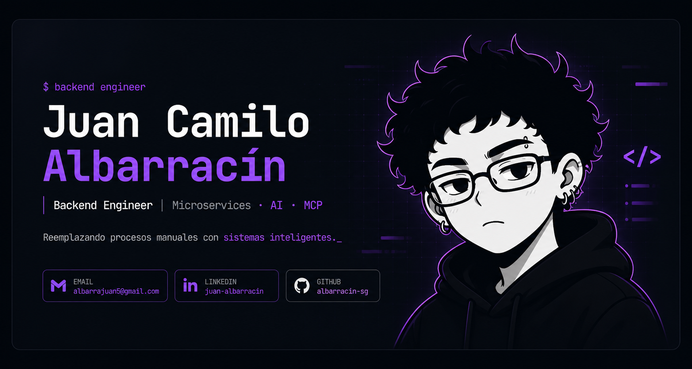
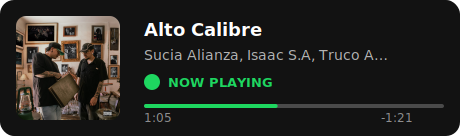

<div align="center">
  
</div>

<br/>

<div align="center">
  <a href="mailto:albarrajuan5@gmail.com">
    
  </a>
  &nbsp;
  <a href="https://github.com/Albarracin-sg">
    
  </a>
</div>

<div align="center">
  <a href="./assets/JUAN_ALBARRACIN_CV.pdf">
    
  </a>
</div>

<br/>

<div align="center">
  
</div>

---

## About


Full-Stack Engineer con foco en backend, especializado en **reemplazar procesos manuales por sistemas inteligentes** usando arquitectura distribuida e IA.

Diseño orquestadores basados en **MCP**, microservicios con **NestJS/gRPC** y pipelines de automatización que eliminan carga operativa real. No optimizo procesos — los transformo.

Aplicación rigurosa de **DDD, CQRS y Clean Architecture** en producción. Capacidad full-stack cuando el producto lo exige con React, Next.js y React Native. Python para datos y automatización.

También diseño y opero **workflows con agentes**, orquestando tools, skills, contexto y ejecución para construir flujos de trabajo confiables, repetibles y orientados a resultados. No se trata solo de usar IA: se trata de convertirla en operación útil.

<br clear="right"/>

---

## How I Work


- **Comunicación clara y ownership** — traduzco problemas complejos en planes ejecutables y mantengo foco en resultado, no solo en implementación.
- **Trabajo en equipo** — colaboro bien con producto, diseño, negocio y desarrollo; me adapto al contexto sin perder criterio técnico.
- **Mentoría y revisión técnica** — acompaño procesos, reviso PRs con intención arquitectónica y ayudo a elevar el nivel del equipo.
- **Pensamiento sistémico** — conecto arquitectura, flujos de trabajo, operación y experiencia final para que el software resuelva problemas reales.
- **Ejecución con agentes y skills** — sé estructurar flujos con agentes, skills, tool calling y contexto operativo para que plataformas como OpenCode trabajen con orden, reutilización y trazabilidad.

<br clear="right"/>

---

## Experience


**Full-Stack Engineer — Backend & Arquitectura**
Universitaria de Colombia · Área de Innovación · *Ene 2025 – 2026*

Diseñé sistemas de microservicios con NestJS, gRPC y PostgreSQL aplicando DDD, CQRS y Clean Architecture en producción. Desacoplé servicios mediante eventos, WebSockets y Webhooks. Gestioné ciclos Scrum completos, mentoricé practicantes y lideré revisión técnica de PRs con GitFlow. Implementé pipelines CI/CD y testing integral con documentación Swagger/OpenAPI.

**Proyectos de alto impacto** *(arquitectura privada)*

- **Orquestador MCP** para universidad e IPS — lenguaje natural → interpretación de intención → tool calling dinámico → consulta real → respuesta precisa. Canal WhatsApp integrado. Eliminó formularios rígidos y estandarizó respuestas eliminando inconsistencias humanas.
- **Evaluación docente con IA** — reemplazó formulario estático de 40 preguntas por modelo dinámico: detección de score bajo → pregunta contextual generada → feedback estructurado persistido → resúmenes automáticos por corte.
- **Integración CRM Conexia + Telnyx** — microservicio intermedio: eventos del CRM → ejecución programática de llamadas y campañas a escala. Eliminó contacto manual de usuarios.
- **Round Robin de asignación** — distribución equitativa de estudiantes entre instructores. Redujo desequilibrios de carga operativa.

<br clear="right"/>

---

## Projects

<div align="center">
  
</div>

<br/>

**Track Vault** — *React Native · NestJS · WebSockets · JWT*

App móvil open source de streaming y descarga local de música. Backend con WebSockets para reproducción en tiempo real, autenticación JWT, integración con APIs externas y sesiones colaborativas tipo jam. Arquitectura full-stack propia — no es un clon.

---

**[E-commerce Web](https://github.com/Albarracin-sg/E-commerce-web)** — *TypeScript · React/Vite · Express · Prisma · PostgreSQL*

Aplicación full-stack con autenticación JWT y testing automatizado end-to-end con Vitest, Supertest, Cypress y Playwright.

---

**[MIS-DOTFILES](https://github.com/Albarracin-sg/MIS-DOTFILES)** — *Arch Linux · Hyprland · Neovim · Zsh*

Entorno de desarrollo Linux reproducible desde cero — Hyprland, Neovim, Waybar, Kitty, Zsh. Setup portable y orientado a productividad real.

---

**Servidor self-hosted** — *Ubuntu Server · Nextcloud*

Configuración y administración de servidor propio con Ubuntu Server, despliegue de Nextcloud y gestión completa de almacenamiento en producción propia.

---

**[ListenUp English](https://github.com/Albarracin-sg/ListenUp-English)**

Plataforma de inglés basada en ejercicios con video, feedback estructurado y flujos de práctica interactiva.

---

## Tech Stack

<div align="center">

**Backend & Architecture**


**Data & Infra**


**AI & MCP**


**Frontend**


**Environment**


</div>

---

## Current Snapshot

```typescript
class JuanAlbarracin {
  readonly role = "Full-Stack Engineer (Backend Focus)";
  readonly specialties = ["Microservices", "Distributed Architecture", "AI & MCP Integration"];
  readonly architecture = ["DDD", "CQRS", "Clean Architecture"];
  readonly backend = ["NestJS", "Node.js", "Python", "PostgreSQL", "gRPC"];
  readonly frontend = ["React", "Next.js", "React Native"];
  readonly environment = ["Arch Linux", "Hyprland", "Neovim", "self-hosted infra"];
  readonly mission = "Replace manual workflows with intelligent systems";

  currentFocus(): string[] {
    return [
      "building backend platforms",
      "designing MCP orchestration flows",
      "shipping production-minded full-stack systems",
    ];
  }

  sayHi(): string {
    return "I care about architecture, clarity, and software that removes operational friction.";
  }
}
```

---

## Currently Listening

<div align="center">
  <!-- spotify:start -->
<a href="https://open.spotify.com/track/3gBcBIHTSd3nab5w53U45C"></a>
<!-- spotify:end -->
</div>

---

## GitHub Analytics

<div align="center">
  
</div>

<div align="center">
  
</div>

<br/>

<div align="center">
  
</div>
